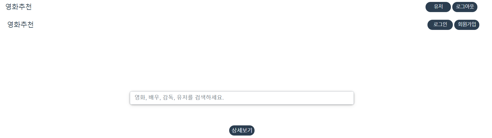
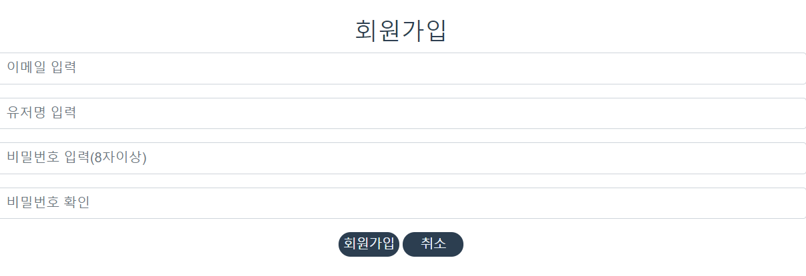
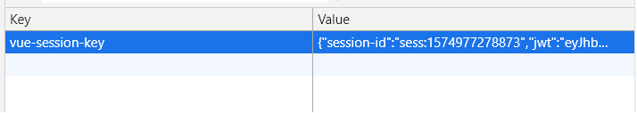
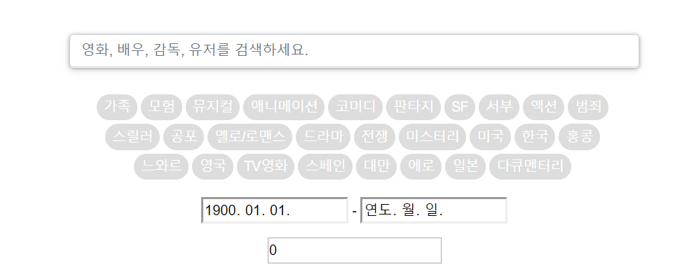
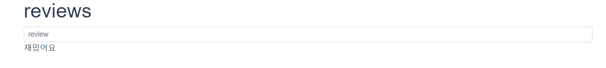

# 세상에 나쁜 영화는 없다.
- 사용 프레임 워크: express + mongodb


# 0. 기능

- 기본적으로 검색기능을 강화함
  - 목적에 맞는 다양한 세부 설정을 제공
- 기본적으로 vuex를 이용하여 정보들을 관리함
  - 특히 자주사용되고 계속해서 관리할 필요가 있는 로그인한 유저정보 등을 활용

```javascript
getters: {
  isLoggedIn(state) {
    return state.token ? true : false
  },
  options(state) {
    return {
      headers: {
        Authorization: 'JWT ' + state.token
      }
    }
  },
  myEmail(state) {
    return state.token ? jwtDecode(state.token).email : null
  },
  getResult(state) {
    return state.searchMovieResults ? true : false
  },
  getUsers(state) {
    return state.findUsers ? true : false 
  }
},
```

## 기본레이아웃

- 기본적인 레이아웃 구글의 검색 엔진과 유사
- 로그인이 되었을 때와 아닐 때 유저정보 사항을 다르게 보여줌



- v-if로 세션에 저장된 로그인  정보를 읽어서 분기

```javascript
<div v-if="isLoggedIn">
  <div @click="goUserPage" class="basic-btn-css mr-1">유저</div>
  <div @click.prevent="logout" class="basic-btn-css mr-1">로그아웃</div>
</div>
<div v-else>
  <div @click="loginClick" class="basic-btn-css mr-1">로그인</div>
  <div @click="signupClick" class="basic-btn-css mr-1">회원가입</div>
</div>
```

## 회원가입 및 로그인

### 회원가입

- 회원가입은 최소한의 정보로 이루어짐
- 회원가입시 유저의 이메일정보를 키값으로 활용
  - 이 후 특정유저를 조회할 수 있음
- 이메일의 경우 자체 형식에 맞는지 검증한 후 서버로 전송

```javascript
// block에 대한 예시
<b-form-group id="signupEmail" :state="state1">
  <b-form-input
    @keyup.enter="signup"
    v-model="credentials.email"
    :state="state1"
    trim
    placeholder="이메일 입력"
  ></b-form-input>
</b-form-group>
```



### 로그인

- 로그인을 하면 서버로 부터 토큰을 발급 받음
- 이 정보를 세션에 저장하여 페이지가 새로고침되어도 유지할 수 있음




## 검색 창

- 기본적인 키워드 검색 뿐 아니라 조건을 설정 할 수 있음
- 해당 화면은 숨어 있다가 필요에 맞게 불러올 수 있음

- v-show를 이용하여 표현

```javascript
<div v-show-slide="featuresOpen" class="div-center detail-search mb-3">
  <!-- 장르 -->
  <genreBtn v-for="(genre, idx) in genres" :key="idx" :genre="genre" />

  <!-- 개봉연도 -->
  <div class="my-3">
    <input v-model="searchInfo.openDt.from" type="date" /> -
    <input v-model="searchInfo.openDt.to" type="date" />
  </div>
(...)
</div>
```


## 검색결과

- 검색 키워드 입력시 영화제목, 감독명, 배우명으로 3 가지 항목을 모두 검색함
  - 해당 카테고리에 해당 하는 값이 없을 경우 보여주지 않음
- 기본적으로 띄어쓰기를 맞추지 않아도 찾을 수 있음


- 검색시 DB에 영화정보를 요청하고 그에 맞게 하위 컴포넌트로 구성하는 형식

```javascript
// movie list
<div @click="goDetailView" class="movie-image" v-bind:style="{ backgroundImage: 'url(' + movie.posterUrl + ')' }">
  <div class="content">
    <!-- <h1 class="title">{{ movie.title }}</h1> -->
    <p class="duration">{{ movie.runningTime }}min</p>
  </div>
</div>
```

- 해당 영화를 클릭하면 상세 정보를 볼 수 있음

## 영화 세부 정보

- 
- 영화에 대한 세부정보로 제공되는 내용은
  - 개봉일, 런닝타임, 배우, 감독, 줄거리 등 
- 보고싶어요를 통해 영화를 찜하고 나중에 해당 영화들만 모아서 볼 수 있음
- 별점을 남겨 만족도를 표시할 수 있음


- 리뷰를 달아 영화에 대한 자신의 생각을 담을 수 있음



## 1. DB연결
- app.py

  ```javascript
  // mongoose로 조작
  const mongoose = require('mongoose')
  
  // port 설정
  const port = process.env.PORT || 3000
  
  // db에 연결시 알림 설정
  const db = mongoose.connection
  db.on('error', function() {
    console.error('error')
  })
  db.once('open', function() {
    console.log('connected')
  })
  
  // mognodb를 연결할 위치 및 디렉토리
  const LOCAL_URI = 'mongodb://localhost/mongodb_tutorial'
  mongoose.connect(LOCAL_URI, {
    useCreateIndex: true,
    useNewUrlParser: true,
    useUnifiedTopology: true,
    useUnifiedTopology: true
  })
  ```

## 2. jwt 관리

- 로그인시 필요
  
    - front에 전달해줘야 함
    
    ```javascript
    // token 생성방법
    let token = jwt.sign({
            email: req.body.email
          },
          secretKey.secret, { expiresIn: '1d' })
    ```

- secretKey파일에는

  ```javascript
  let jwtObj = {}
  jwtObj.secret = 'Secretkey'
  
  module.exports = jwtObj
  ```


## 3. Model
- 관계형 DB가 아닌 MongoDB를 사용하므로 방대한 관계를 맺는 모델링을 하지 않음
  
- 대신에 User모형과 Movie모형만 사용하면서 관계를 다룰 수 있음
  
- Movie의 스키마는 다음과 같음

  ```javascript
  const movieSchema = new Schema({
  index: {
    type: Number,
    unique: true
  },
  title: String,
  title_trim: String,
  openDt: Date,
  score: { type: Float },
  rate: Array,
  directors: Array,
  directors_name: Array,
  actors: Array,
  actors_name: Array,
  description: String,
  posterUrl: String,
  genres: Array,
  runningTime: Number,
  preview: String,
  like_users: Array, // user, like
  reviews: Array // user, rate, content
  }, { collection: 'movies' })
  ```

## 4. Routes
- 들어온 요청에 대한 함수로직을 짜는 곳임
- 실제로 사용하는 routes는 모델과 마찬가지로 movies와 users만 사용함
- 기본적으로 RESTful하게 구성

### 1) movies
- 기본적으로 컨셉에 맞게 검색기능에 집중함
- 영화정보에 대한 조작은 관리자만 사용할 수 있음

#### GET
- 전체조회
  
    - 기본적으로 관심이 갈 법한 영화목록을 전달함
    
- 쿼리문을 통해서 제어
  
    ```javascript
    router.get('/', async function(req, res, next) {
    Movie.find({}).lt('openDt', date())
      .sort('-openDt -score')
      .ne('score', null)
      .limit(50)
      .then((movies) => {
        // console.log(movies[0])
        if (!movies.length) {
          return res.status(404).send({ message: 'error' })
     }
      res.json(movies)
        })
      })
    ```
    
      
    
- 특정 영화 조회
    - DB의 부피를 줄이기 위해 사용
    - 영화 정보를 저장할 필요가 있을 때 영화의 ID값만 저장하고 필요시 불러옴

#### POST
- 검색기능
    - 검색에 필요한 옵션을 전달 받을 필요가 있으므로 post로 설정함
    - DB에 있는 모든 요소에 대해서 조건을 받을 수 있음
    - 본 서비스에서는 기간과 평점 등에 대해 조건을 달아줌
        - if 로직으로 정보가 들어오는 경우에만 조건에 맞게 정렬하게 함
    
    ```javascript
    router.post('/search', async function(req, res) {
      let movie_title
      let movie_actor
      let movie_director
      let result
      let genres = []
    
      if (req.body.keyword) {
        let target = req.body.keyword.split(' ').join('')
        movie_title = Movie.find({ title_trim: { $regex: target, $options: "ix" } })
        movie_actor = Movie.find({ actors_name: { $in: target } })
        movie_director = Movie.find({ directors_name: { $in: target } })
    ```

- 관련기능
    - 관련기능으로는 댓글, 찜하기, 평점이 존재
    - 함수 실행시 movies와 users 양쪽에 정보를 저장함
    - 단일인에 대한 데이터 조작을 방지하고자 중복 평점과 찜하기기능을 막아놈
    
    ```javascript
    router.post('/:index/like', async function(req, res) { 
      let movie = await Movie.findOne({ index: req.params.index })
      if (movie.like_users.includes(req.body.email)) {
        movie.like_users.splice(movie.like_users.indexOf(req.body.email), 1)
      } else {
        movie.like_users.push(req.body.email)
      }
    
      movie.save()
    
      let user = await User.findOne({ email: req.body.email })
      if (user.like_movies.includes(req.params.index)) {
        user.like_movies.splice(user.like_movies.indexOf(req.params.index), 1)
      } else {
        user.like_movies.push(req.params.index)
      }
    
      user.save()
    
      res.send('successfully saved')
    })
    ```

### 2) User
- 기본적으로 관리자만 접근 가능한 기능들임(get요청 없음)
#### POST
- 회원가입
    - front에서 1차로 validation한 값을 활용
    - 회원정보가 있을 경우 저장하지 않고 오류를 출력함
    
  ```javascript
  router.post('/signup', async function(req, res) {
    const user = await User.findOne({ email: req.body.email })
    if (!user) {
      User.create(req.body)
      res.send('success')
      } else {
    res.json({ message: 'error' })
    }
  ```
  
- 로그인
    - 이전에 설정한 jwt를 활용하는 단계
    - 마찬가지로 front에서 확인한 정보를 받아 일치여부를 판단하여 token를 넘겨주어 front에서 관리함
    
  ```javascript
  router.post('/login', async function(req, res) {
    const user = await User.findOne({ email: req.body.email })
    if (user) {
      let token = jwt.sign({
          email: req.body.email
      },
      secretKey.secret, { expiresIn: '1d' })
  
    if (user.email === req.body.email && user.password === req.body.password) {
        res.json({ message: token })
      } else {
        res.json({ message: 'error' })
      }
    } else { // 회원정보가 없으면
      res.json({ message: 'error' })
  }
})
  ```
  
- 유저조회
  - 해당 기능은 userId와 email(pk)로 검색을 제공함
  - 유저간의 커뮤니티 기능을 제공하기 위해서 사용함(다른 사람이 찜한 영화 보기 등)
  
  ```javascript
  router.post('/id', async function(req, res) {
    const users = await User.find({ userId: req.body.userId }).select('userId email')
    res.json({ result: users })
  })
  ```

- 정보 수정 및 삭제
  
    - RESTful한 api를 만들기 위해서 put과 delete메서드를 사용해서 구현